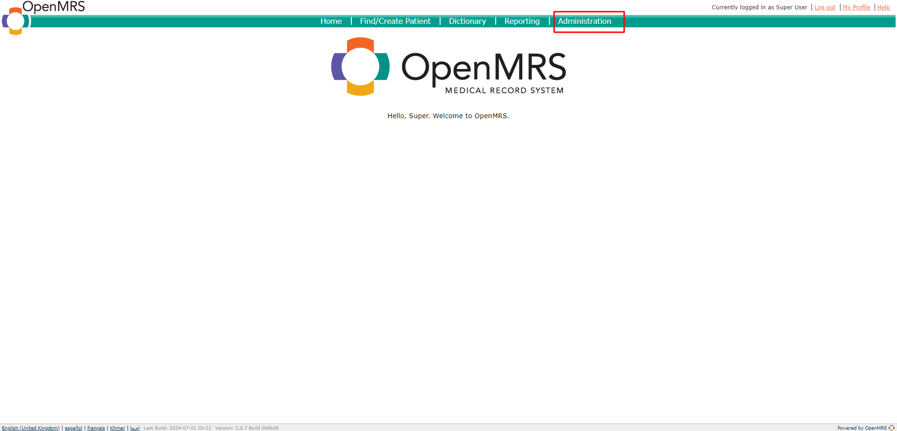
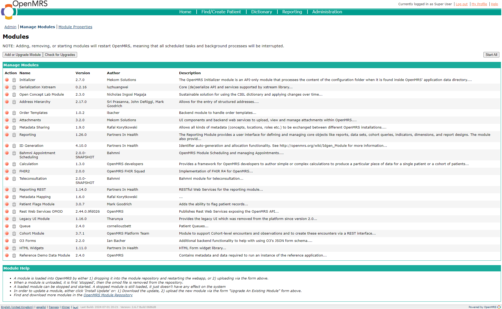
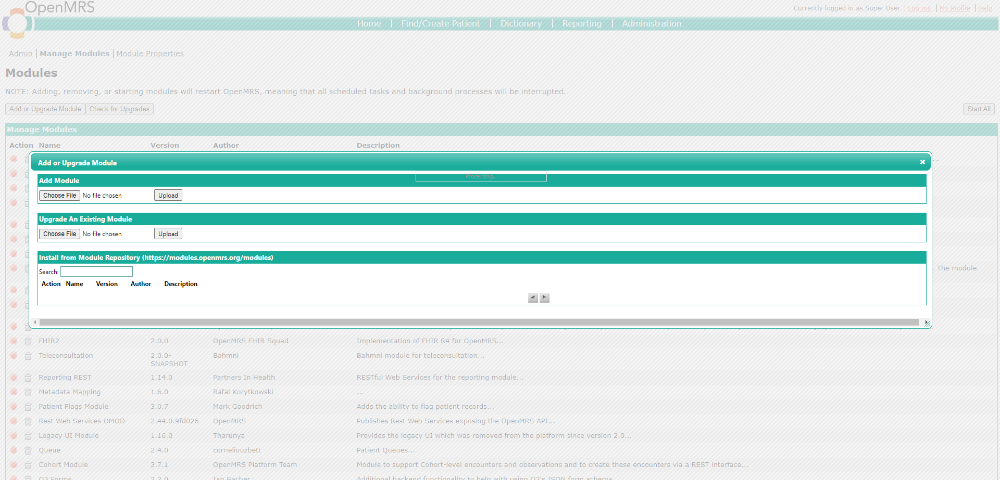

# Setting up OpenMRS 3 for development

###### Rev 06/24/2024

## Requirements

* Docker
* Buildkit with buildx (Docker Desktop already comes with this, but you need to install it on Linux) 

## Steps

1. Go to [https://github.com/openmrs/openmrs-distro-referenceapplication](https://github.com/openmrs/openmrs-distro-referenceapplication) and the [release tags page](https://github.com/openmrs/openmrs-distro-referenceapplication/tags)

2. Find and click on the version you want to use. (This tutorial uses [v1.0.0-ALPHA](https://github.com/openmrs/openmrs-distro-referenceapplication/releases/tag/1.0.0-ALPHA))

3. Download the source code (either tar.gz or zip, whichever you prefer)

4. Extract the contents to directory of your choice

5. The repository root (`openmrs-distro-referenceapplication-your-version`) directory will have `docker-compose.yml` file. Enter this directory.

6. We will use `docker-compose.yml` for this tutorial.
   
   1. Optional: If you want easy access to the database, you can modify `docker-compose.yml` to add a public port mapping to SQL port 3306
      
      1. Open `docker-compose.yml`
      
      2. Find the line that defines the `db `container
      
      3. Add lines 
         
         ```
         ports:
           - "3306:3306"
         ```

7. Run `docker compose up -d `in the repository root directory. 

8. When it is finished, navigate to [http://localhost/openmrs/](http://localhost/openmrs/).You should see the following page


9. Wait for installation to complete. Once it is finished, you will see the following screen. (You might need to restart the docker containers)


10. Log in with the following credentials:
    
    ```
    Username: admin
    Password: Admin123
    ```

# Compiling and Installing CDSS module

The cdss module is the module that provides the api for the common module. It does not include the user interface, but does create the data tables, API endpoints, configurations and other necessary components. 

## Requirements

* Maven

* Java 17

## Compiling the CDSS module

1. Clone the repository: [https://github.com/xjing16/EMR_EHR4CDSSPCP](https://github.com/xjing16/EMR_EHR4CDSSPCP)

2. Navigate to` EMR_EHR4CDSSPCP/OpenMRS/cdss/`

3. You will see the directory `api`, directory `omod `and `pom.xml. `
   
    Run command `mvn clean install `to compile into a .omod file (Run `mvn clean install -DskipTests `instead to avoid unit tests)

4. Wait for the compilation to finish

5. Once the compilation has completed, navigate to `EMR_EHR4CDSSPCP/OpenMRS/cdss/omod/target`

6. There will be a file with an extension of `.omod`. (Example: `cdss-1.0.0-ALPHA.omod`) This is the compiled module. We will utilize it later when we install it into the OpenMRS system

## Installing the CDSS module using the GUI

1. Log into OpenMRS.
   
   

2. Find <u>Administration</u> in the top right of the main menu. Click it



3. Find <u>Manage modules</u> on the screen. Click it.


4. Find the <u>Add or Upgrade Module</u> button. 



5. Click the <u>Add or Upgrade Module</u> button. 



6. In the popup, click <u>Choose file</u> in the <u>Add Module</u> section.

7. Select the compile `.omod` file. Click <u>Upload</u>
   
   1. If you get a `HTTP 413 Request Entity Too Large` error, then the `.omod` file is too large to be installed (usually because of content in resources directory inside the `.omod` file). You can install the `.omod` file manually (see below) or change Nginx server settings to allow for large file upload (See )

## Installing the CDSS module manually

You can also install CDSS module file by coping the `.omod` into the OpenMRS backend container (usually named `openmrs/openmrs-reference-application-3-backend`)

1. Find the container id of the backend container. Run  `docker container ps` and take note of the container id of container named `openmrs/openmrs-reference-application-3-backend` (or similar)

2. Run `docker cp cdss-1.0.0-ALPHA.omod backend_container_id:/openmrs/data/modules/cdss-1.0.0-SNAALPHAod`to copy `cdss-1.0.0-SNAPSHALPHA into the backend container at directory `/openmrs/data/modules/` 

3. Run `docker container restart backend_container_id` to restart the backend

## Verify CDSS module is running

You can verify that CDSS module is successfully running by looking at its status in the <u>Manage Modules</u> page. See figure below


Additionally, you send a `GET` request to `http://localhost/openmrs/cdss/rule.form` to see all the rules that the CDSS module is using. This will respond with a JSON array of strings. Note: You must validate the session first by logging into OpenMRS.

Example response:

```json
["29d386b1-fc91-41f8-9386-b1fc9181f8b2",
  "a947fd89-fb3e-4555-87fd-89fb3e455588",
  "a8edba14-0d8b-4adc-adba-140d8bcadca7",
  "1ef7a883-1d71-4cd6-b7a8-831d71ccd68f",
  "3dc04c93-3109-4284-804c-93310992846c",
  "d7936c27-fa0a-4a63-936c-27fa0a7a63bf",
  "5fc3f746-63a1-4497-83f7-4663a1e497dd",
  "29b20267-76db-4a90-b202-6776dbaa90f3",
  "db829f86-b414-4ebc-829f-86b414eebcef",
  "aca80b30-a2ec-4380-a80b-30a2ec4380af",
  "c6defa17-be0d-4e04-9efa-17be0d3e04ea"]
```

## Configure the CDSS module

### Set the UMLS API key

The CDSS module requires a UMLS API key to download valuesets. Use the [UMLS Metathesaurus Browser](https://uts.nlm.nih.gov/uts/login) to create an API key. 

1. Log into OpenMRS.
   
   

2. Find <u>Administration</u> in the top right of the main menu. Click it
   
   

3. Find <u>Advanced Settings</u>. Click it.
   
   

4. Scroll down and find the property named `cdss.vsacApiKey`. Alternatively, you can search for it.
   
   

5. Change the value `No key set` to you VSAC API Key

6. Click save in the yellow box in the lower right corner.
   
   

# Compiling and Installing the CDSS ESM app

The CDSS ESM app is the GUI frontend component for CDSS in OpenMRS. It is compiled separately from the CDSS module, and likewise installed separately. The ESM app relies heavily on the CDSS module, and the ESM app must be installed after the CDSS module is installed and successfully running. The ESM module is built with React,  Typescript. It uses Yarn as the dependency manager. For a design framework, it uses IBM's Carbon Design system

## Setting up the ESM module for development

## Requirements:

* NodeJS v20.16.0 [Node.js — Download Node.js®](https://nodejs.org/en/download/package-manager)

* Yarn [Installation | Yarn](https://classic.yarnpkg.com/lang/en/docs/install/#windows-stable)

## Steps

1. Clone the repository: https://github.com/xjing16/EMR_EHR4CDSSPCP (If you followed previous steps, then the repository will be already cloned)

2. Navigate to `EMR_EHR4CDSSPCP/OpenMRS/openmrs-esm-cdss-app/`. This is the directory where the ESM app is stored.

3. Install all dependencies by running `yarn install`

4. To run the ESM module, run `npm run start` 
   
   1. Note: By running `npm run start` , you are actually running `openmrs develop --backend  http://127.0.0.1:80`, as defined in `package.json`. This command start a development server derived from OpenMRS running on `127.0.0.1:80`. Thus, it is necessary to run the OpenMRS docker on `127.0.0.1:80` (the `docker-compose.yml` file does this by default)

5. Now you can see changes to your ESM module by accessing `http://127.0.0.1:8080/openmrs/spa/home`

## Compiling the ESM app

1. To compile the ESM app, run `npm run build`. 
   1. This will run `webpack --mode production` and create  `dist` folder with the contents of the compiled app

## Installing the compiled app

Normally, developers would publish their ESM modules on NPM (for example [@openmrs/esm-navigation]([https://www.npmjs.com/package/@openmrs/esm-navigation)) and configure OpenMRS to download the app automatically. However,while the CDSS app is not ready for public use, it is necessary to install it manually.

1. Find the container id of the frontend container. Run  `docker container ps` and take note of the container id of container named `openmrs/openmrs-reference-application-3-frontend` (or similar)

2. Take note of the version and name of the CDSS app. Open `package.json`. There are two lines that define this:
   
   ```json
   "name": "@openmrs/esm-cdss-app",
   "version": "1.0.0-ALPHA"
   ```

3. Copy the entire `dist` directory into the frontend container `docker cp dist frontend_container_id:/usr/share/nginx/html/openmrs-esm-cdss-app-1.0.0-ALPHA`. Note: the `openmrs-cdss-app-1.0.0-ALPHA` name should be adjusted based on the actual name of the CDSS app and the version as determined in the previous step.

4. `routes.registry.json` needs to also be updated to reflect the CDSS app installation. Download `routes.registry.json` from the frontend container with `docker cp frontend_container_id:/usr/share/nginx/html/routes.registry.json routes.registry.json`

5. Open the downloaded `routes.registry.json`. This file contains all the links and action of all installed apps. Our compiled CDSS app also has a `routes.json` file. Copy the contents of `dist/routes.json` and paste them into `routes.registry.json`  under the app name of `@openmrs/esm-cdss-app` (or the actual name of the app).
   
   ```json
     {
   // ...routes.resgistry.json contents
   
   "@openmrs/esm-cdss-app": { // routes.json contents
     "$schema": "https://json.openmrs.org/routes.schema.json",
     "backendDependencies": {
       "fhir2": ">=1.2.0",
       "webservices.rest": ">=2.24.0",
       "cdss": "1.0.0-ALPHA"
     },
     "extensions": [{"name":"cdss-chart","component":"cdssChart","slot":"patient-chart-cdss-dashboard-slot","meta":{"columnSpan":4},"order":8},{"name":"cdss-summary-dashboard","component":"cdssDashboardLink","slot":"patient-chart-dashboard-slot","meta":{"slot":"patient-chart-cdss-dashboard-slot","columns":1,"path":"Cdss"},"order":12},{"name":"cdss-reports-link","slot":"app-menu-slot","component":"cdssReportsLink","online":true,"offline":true},{"name":"cdss-management-link","slot":"app-menu-slot","component":"cdssManagementLink","online":true,"offline":true},{"name":"cdss-archive-link","slot":"app-menu-slot","component":"cdssArchiveLink","online":true,"offline":true}],
     "pages": [{"component":"cdssReportsPage","route":"cdss/reports","online":true,"offline":true},{"component":"cdssModificationPage","route":"cdss/edit","online":true,"offline":true},{"component":"cdssArchivePage","route":"cdss/archive","online":true,"offline":true}],
     "version": "1.0.0-ALPHA"
    }
   }
   ```

6. Copy the update `routes.registry.json` back into the frontend container with  `docker cp routes.registry.json frontend_container_id:/usr/share/nginx/html/routes.registry.json`

7. Finally, `importmap.json` needs to be updated. The importmap defines where the code for apps is to be found. Download `importmap.json` with `docker cp frontend_container_id:/usr/share/nginx/html/importmap.json importmap.json`

8. Add a new line that defines `"@openmrs/esm-cdss-app"` with the value of `"./openmrs-esm-cdss-1.0.0-ALPHA/openmrs-esm-cdss-app.js"` (Note: you may need to adjust the version and name based on the values in `package.json`)
   
   ```json
   { // Other contents from importmap.json
    "@openmrs/esm-cdss-app": "./openmrs-esm-cdss-app-1.0.0-ALPHA/openmrs-esm-cdss-app.js"
   }
   ```

9. Copy the updated `importmap.json` to the frontend container with `docker cp importmap.json  frontend_container_id:/usr/share/nginx/html/importmap.json`
   
   # 
   
   # Common Issues
   
   ## HTTP 413 Request Entity Too Large

When uploading a new module `.omod` you might run into an `HTTP 413 Request Entity Too Large` error. By default, OpenMRS's server software, Nginx, limits uploads to a size of 1 Megabyte (See [413 Request Entity Too Large While installing openmrs module - OpenMRS Talk](https://talk.openmrs.org/t/413-request-entity-too-large-while-installing-openmrs-module/26524)). Most most modules are bigger than 1Mb, an this error comes up. To increase the upload limit, enter the `openmrs-distro-referenceapplication-300-gateway` container, and edit `/etc/nginx/nginx.conf` with the following. In the `http` section, add/modify the line that says `client_max_body_size` with an amount of your choice that is big enough for uploads. In the following example, it is set to 50Mb

Lastly, simply restart the container.

```
http {
  client_max_body_size     50M;
}
```
