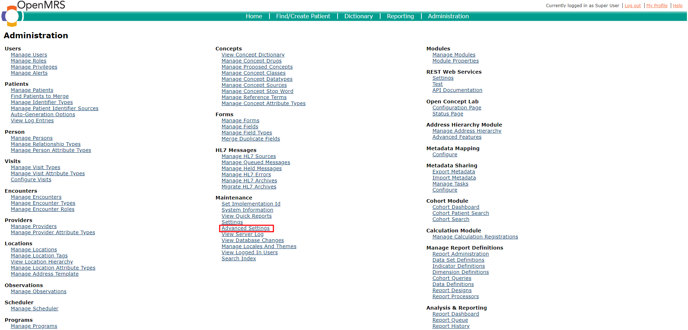

# Setting up OpenMRS 3 for development

###### Rev 06/24/2025

## Requirements

* [Docker](https://docs.docker.com/get-docker/)
* Buildkit with buildx (Docker Desktop already comes with this, but you need to install it on Linux)

## Steps

1. Go
   to [https://github.com/openmrs/openmrs-distro-referenceapplication](https://github.com/openmrs/openmrs-distro-referenceapplication)
   and the [release tags page](https://github.com/openmrs/openmrs-distro-referenceapplication/tags)

2. Find and click on the version you want to use. (This tutorial
   uses [v3.0.0](https://github.com/openmrs/openmrs-distro-referenceapplication/releases/tag/3.0.0))

3. Download the source code (either tar.gz or zip, whichever you prefer)

4. Extract the contents to directory of your choice

5. The repository root (`openmrs-distro-referenceapplication-your-version`) directory will have `docker-compose.yml`
   file. Enter this directory.

6. We will use `docker-compose.yml` for this tutorial.
   
   1. Optional: If you want easy access to the database, you can modify `docker-compose.yml` to add a public port
      mapping to SQL port 3306
      
      1. Open `docker-compose.yml`
      
      2. Find the line that defines the `db `container
      
      3. Add lines
         
         ```
         ports:
           - "3306:3306"
         ```

7. Run `docker compose up -d `in the repository root directory.

8. When it is finished, navigate to [http://localhost/openmrs/](http://localhost/openmrs/). You should see the following
   page


9. Wait for installation to complete. Once it is finished, you will see the following screen. (You might need to restart
   the docker containers)


10. Log in with the following credentials:
    
    ```
    Username: admin
    Password: Admin123
    ```

# Installing CDSS module

The cdss module is the module that provides the api for the common module. It does not include the user interface, but
does create the data tables, API endpoints, configurations and other necessary components.

## Download CDSS module

1. Go to [https://github.com/xjing16/EMR_EHR4CDSSPCP/releases](https://github.com/xjing16/EMR_EHR4CDSSPCP/releases)
2. Choose the version you want
3. Download the`.omod file`

## Installing the CDSS module using the GUI

1. Log into OpenMRS.
   
   

2. Find <u>Administration</u> in the top right of the main menu. Click it


3. Find <u>Manage modules</u> on the screen. Click it.


4. Find the <u>Add or Upgrade Module</u> button.


5. Click the <u>Add or Upgrade Module</u> button.


6. In the popup, click <u>Choose file</u> in the <u>Add Module</u> section.

7. Select the compile `.omod` file. Click <u>Upload</u>

> **Warning:** If you get a `HTTP 413 Request Entity Too Large` error, then the `.omod` file is too large to be
> installed (usually because of content in resources directory inside the `.omod` file). You can install the `.omod` file
> manually (see below) or change Nginx server settings to allow for large file upload.

## Installing the CDSS module manually

You can also install CDSS module file by coping the `.omod` into the OpenMRS backend container (usually named
`openmrs/openmrs-reference-application-3-backend`)

1. Find the container id of the backend container. Run `docker container ps` and take note of the container id of
   container named `openmrs/openmrs-reference-application-3-backend` (or similar)

2. Run `docker cp cdss-1.0.0-ALPHA.omod backend_container_id:/openmrs/data/modules/cdss-1.0.0-ALPHA.omod` to copy
   `cdss-1.0.0-ALPHA.omod` into the backend container at directory `/openmrs/data/modules/`

3. Run `docker container restart backend_container_id` to restart the backend

## Verify CDSS module is running

You can verify that CDSS module is successfully running by looking at its status in the <u>Manage Modules</u> page. See
figure below


Additionally, you send a `GET` request to `http://localhost/openmrs/cdss/rule.form` to see all the rules that the CDSS
module is using. This will respond with a JSON array of strings. Note: You must validate the session first by logging
into OpenMRS.

Example response:

```json
[
  "29d386b1-fc91-41f8-9386-b1fc9181f8b2",
  "a947fd89-fb3e-4555-87fd-89fb3e455588",
  "a8edba14-0d8b-4adc-adba-140d8bcadca7",
  "1ef7a883-1d71-4cd6-b7a8-831d71ccd68f",
  "3dc04c93-3109-4284-804c-93310992846c",
  "d7936c27-fa0a-4a63-936c-27fa0a7a63bf",
  "5fc3f746-63a1-4497-83f7-4663a1e497dd",
  "29b20267-76db-4a90-b202-6776dbaa90f3",
  "db829f86-b414-4ebc-829f-86b414eebcef",
  "aca80b30-a2ec-4380-a80b-30a2ec4380af",
  "c6defa17-be0d-4e04-9efa-17be0d3e04ea"
]
```

## Configure the CDSS module

### Set the UMLS API key

The CDSS module requires a UMLS API key to download valuesets. Use
the [UMLS Metathesaurus Browser](https://uts.nlm.nih.gov/uts/login) to create an API key.

1. Log into OpenMRS.
   
   

2. Find <u>Administration</u> in the top right of the main menu. Click it
   
   

3. Find <u>Advanced Settings</u>. Click it.
   
   

4. Scroll down and find the property named `cdss.vsacApiKey`. Alternatively, you can search for it.
   
   

5. Change the value `No key set` to your VSAC API Key

6. Click save in the yellow box in the lower right corner.
   
   

# Installing the CDSS ESM app

The CDSS ESM app is the GUI frontend component for CDSS in OpenMRS. It is compiled separately from the CDSS module, and
likewise installed separately. The ESM app relies heavily on the CDSS module, and the ESM app must be installed after
the CDSS module is installed and successfully running. The ESM module is built with React, Typescript. It uses Yarn as
the dependency manager. For a design framework, it uses IBM's Carbon Design system

> **Note:** The ESM app relies heavily on the CDSS module, and the ESM app must be installed ***after*** the CDSS module
> is installed and successfully running.

## Setting up the ESM module

## Download the CDSS ESM app

1. Go to https://github.com/xjing16/EMR_EHR4CDSSPCP/releases
2. Choose the version you want
3. Download the `openmrs-esm-cdss-app-YOUR VERSION.zip` file

## Installing the app

Normally, developers would publish their ESM modules on NPM (for
example [@openmrs/esm-navigation]([https://www.npmjs.com/package/@openmrs/esm-navigation)) and configure OpenMRS to
download the app automatically. However,while the CDSS app is not ready for public use, it is necessary to install it
manually.

1. Find the container id of the frontend container. Run`docker container ps` and take note of the container id of
   container named `openmrs/openmrs-reference-application-3-frontend` (or similar)

2. Extract the contents of `openmrs-esm-cdss-app-YOUR VERSION.zip`. There will be a `dist` folder and a `routes.json`
   inside.

3. Download the ESM App installer script into the same directory as `openmrs-esm-cdss-app-YOUR VERSION.zip`.
   
   - If on Linux, use [Deploy-Cdss-ESM-App.sh](https://github.com/xjing16/EMR_EHR4CDSSPCP/blob/main/OpenMRS/utilities/Deploy-Cdss-Esm-App.sh)
   - If on Windows, use [Deploy-Cdss-Esm-App.ps1](https://github.com/xjing16/EMR_EHR4CDSSPCP/blob/main/OpenMRS/utilities/Deploy-Cdss-Esm-App.ps1)

4. Run the ESM app installer script
   
   - If on Linux, run
     
     ```bash
     ./Deploy-Cdss-Esm-App.sh frontend_container_id openmrs-esm-cdss-app-YOUR VERSION.zip
     ```
   
   - If on Windows, run
     
     ```bash
     ./Deploy-Cdss-Esm-App.ps1 frontend_container_id openmrs-esm-cdss-app-YOUR VERSION.zip
     ```

> **NOTE:** Replace `frontend_container_id` with the id of the container of the frontend and
> `openmrs-esm-cdss-app-YOUR VERSION.zip` with the filename of your downloaded ESM CDSS zip file.

## Verify that CDSS ESM app is installed

1. Go to [http://localhost/openmrs/spa/home](http://localhost/openmrs/spa/home) and click on the *App menu*.
   

2. If the app is installed successfully, then you will see *CDSS Reports*, *CDSS Rule Management*, and *CDSS Rule Archive*.
    

# Common Issues

## HTTP 413 Request Entity Too Large

When uploading a new module `.omod` you might run into an `HTTP 413 Request Entity Too Large` error. By default,
OpenMRS's server software, Nginx, limits uploads to a size of 1 Megabyte (
See [413 Request Entity Too Large While installing openmrs module - OpenMRS Talk](https://talk.openmrs.org/t/413-request-entity-too-large-while-installing-openmrs-module/26524)).
Most modules are bigger than 1Mb, an this error comes up. To increase the upload limit, enter the
`openmrs-distro-referenceapplication-300-gateway` container, and edit `/etc/nginx/nginx.conf` with the following. In the
`http` section, add/modify the line that says `client_max_body_size` with an amount of your choice that is big enough
for uploads. In the following example, it is set to 50Mb

Lastly, simply restart the container.

```
http {
  client_max_body_size     50M;
}
```
