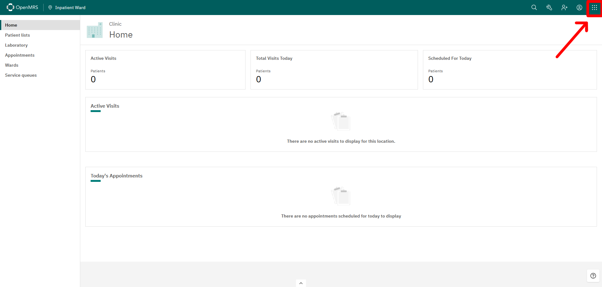

# View Reports

###### Rev 06/24/2024

## Requirements

- OpenMRS with the `cdss` module and `cdss-esm-app` module. Follow [Technical INSTALLATION.md](https://github.com/xjing16/EMR_EHR4CDSSPCP/blob/main/OpenMRS/docs/Installation-Technical/INSTALLATION.md) or [User friendly INSTALLATION.md](https://github.com/xjing16/EMR_EHR4CDSSPCP/blob/main/OpenMRS/docs/Installation-User-Friendly/INSTALLATION.md).

## Steps

1. Go to the OpenMRS homepage and click on *App Menu*
    

2. Click on *CDSS Reports* 
    

3. This is the CDSS Reports page
    
