# Rule Management

###### Rev 06/24/2024

## Table of Contents

- [Requirements](#requirements)
- [Navigating the Rule Management Interface](#navigating-the-rule-management-interface)
  - [Switching Views](#switching-views)
  - [Expanding Rules](#expanding-rules)
- [Enabling/Disabling Rules](#enablingdisabling-rules)
  - [Disabling a Rule](#disabling-a-rule)
  - [Enabling a Rule](#enabling-a-rule)
- [Modifying Rules](#modifying-rules)
  - [Understanding Parameters](#understanding-parameters)
  - [Modify a Parameter](#modify-a-parameter)
- [Upload a Rule](#upload-a-rule)
  - [Example Rule Upload](#example-rule-upload)
- [Archiving Rules](#archiving-rules)
  - [Archive a Rule](#archive-a-rule)
  - [View Archived Rules](#view-archived-rules)
  - [Restore an Archived Rule](#restore-an-archived-rule)

## Requirements

- OpenMRS with the `cdss` module and `cdss-esm-app` module. Follow [Technical INSTALLATION.md](https://github.com/xjing16/EMR_EHR4CDSSPCP/blob/main/OpenMRS/docs/Installation-Technical/INSTALLATION.md) or [User friendly INSTALLATION.md](https://github.com/xjing16/EMR_EHR4CDSSPCP/blob/main/OpenMRS/docs/Installation-User-Friendly/INSTALLATION.md).
- Functional Rule Modification service. Follow [RULE_MODIFICATION_SERVICE_INSTALLATION.md](https://github.com/xjing16/EMR_EHR4CDSSPCP/blob/main/OpenMRS/docs/Rule-Modification-Service-Installation/RULE_MODIFICATION_SERVICE_INSTALLATION.md)
- CSRF disabled

## Navigating the Rule Management interface

1. Go to the [OpenMRS homepage](http://localhost/openmrs/spa) and click on *App Menu* in the top right.
    

2. Click on *CDSS Rule Management* 
    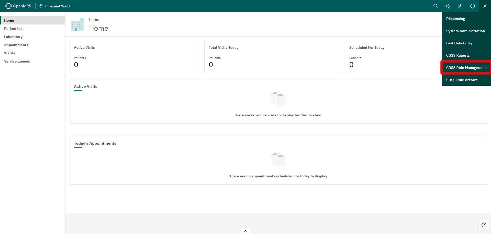

3. This is the *CDSS Rule Management* page
    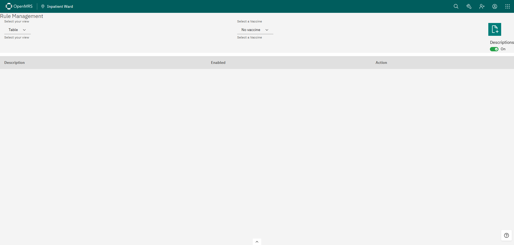

4. The page is blank because vaccine is not selected.
   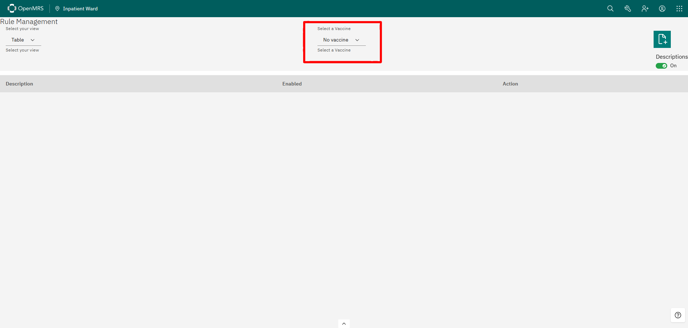

5. Select a *Measles, Mumps, and Rubella Virus Vaccine* from the center dropdown. This view is a table view that display every rule per row. The columns represent descriptions, rule parameters (denoted with a *$*) and actions.  
   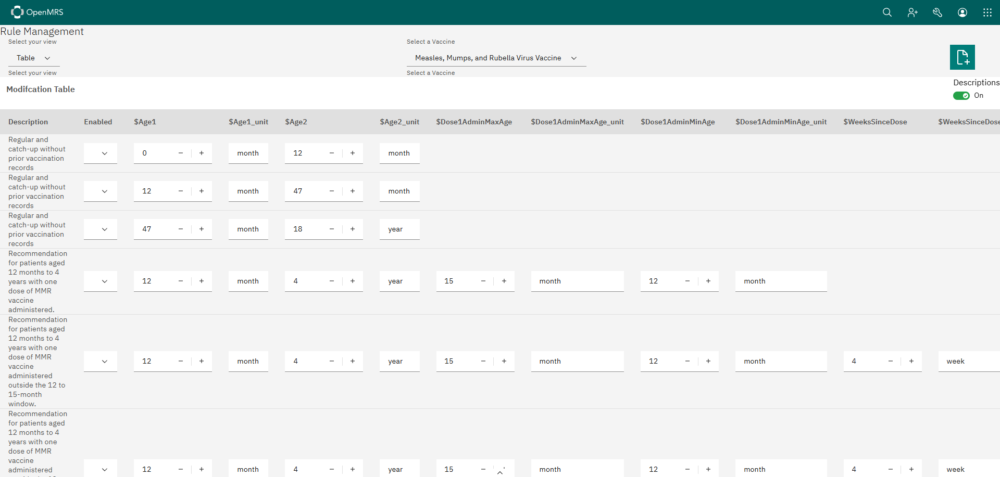

6. The table view may be overwhelming, so lets change it. Select *List* from the *View* dropdown in the top left.
   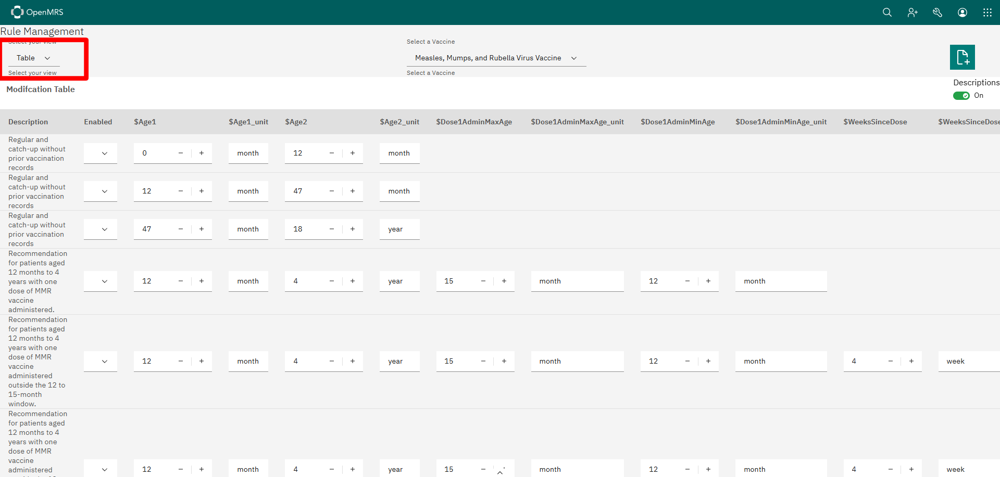

7. This view collapses each rule into an expandable element. 
   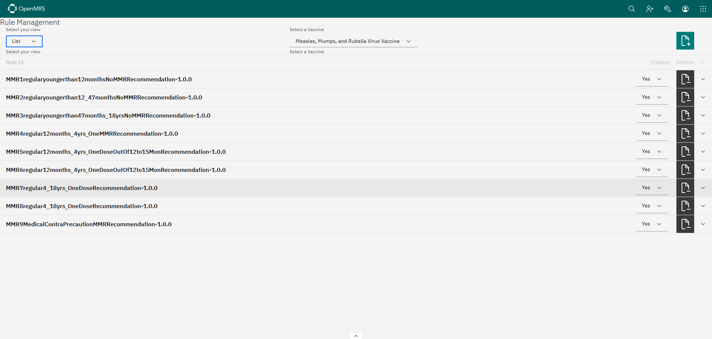

8. Click on any rule, and it will expand to show its elements
   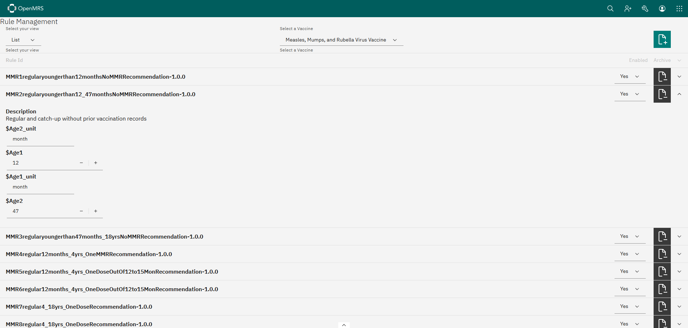

## Enabling/Disabling Rules

If a rule is disabled, that means it will not be used in Clinical Decision Suppport and cannot be modified. Only enabled rules are used in CDS and are able to be modified. 

### Disabling a Rule

1. To disable a rule, select the *No* option on the *Enabled* column of the rule
   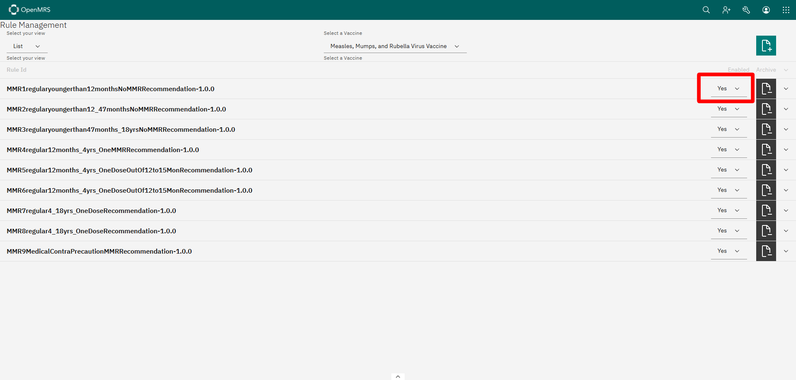
2. This will make two more buttons appear: *Save* and *Reset*. Click *Save* to save the disable action. *Reset* will revert the disable option to it's default. 
   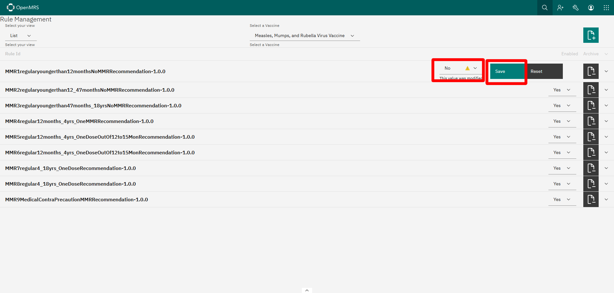
3. Once *Save* is clicked, the rule will be disabled and no longer usable.
   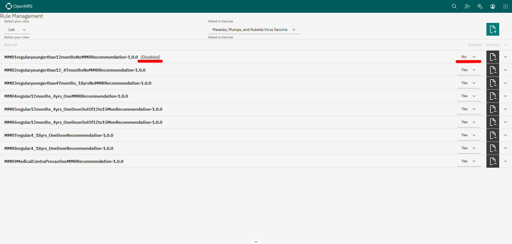

### Enabling a Rule

1. To enable a rule, select the *Yes* option on the *Enabled* column of the rule
2. This will make two more buttons appear: *Save* and *Reset*. Click *Save* to save the enable action. *Reset* will revert the enable option to it's default. 
3. Once *Save* is clicked, the rule will be enabled and usable.

## Modifying Rules

Only parameters on enabled rules can be modified. Make sure to enable the rule that you want to modify before changing parameters.
A parameter is a special expression in the CQL that begins with a `$` and returns a primitive value. For example the highlighted paramater `$Age2` in the following screenshot is defined as the following in CQL
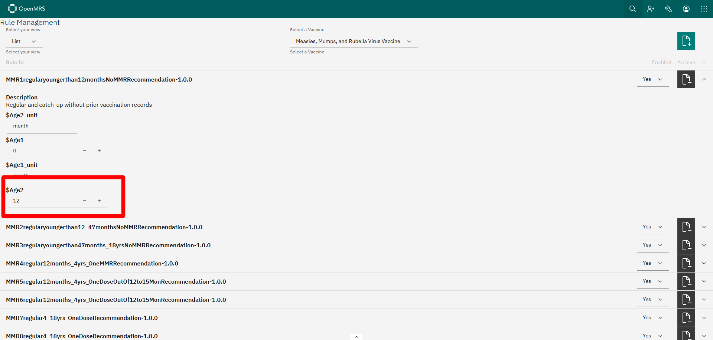

```cql
define "$Age2": 
    12
```

And as the following in the `rule-manifest.json` file.

```json
{
"$Age2": {
          "type": "Integer",
          "value": 12,
          "default": 12
        }
}
```

### Modify a parameter

1. Choose the parameter that you want to modify. In this example, we will modify `$Age2` of the rule `MMR1regularyoungerthan12monthsNoMMRRecommendation-1.0.0`.

2. `$Age2` is an integer value, so simply type in a new integer or use the +/- buttons to right to adjust it's value. We will change it to be `15`.
   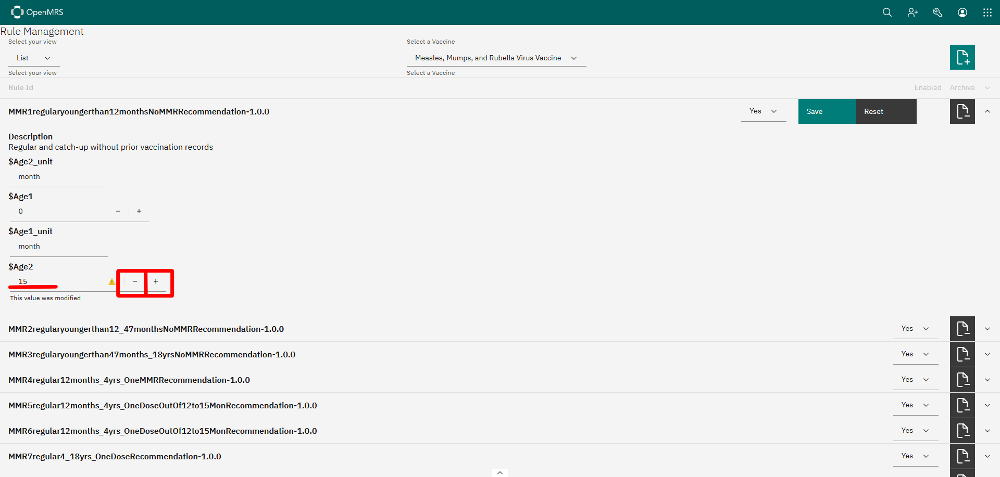

3. This will cause two more buttons to appear: *Save* and *Reset*. Click save to to make your change perminent. 
   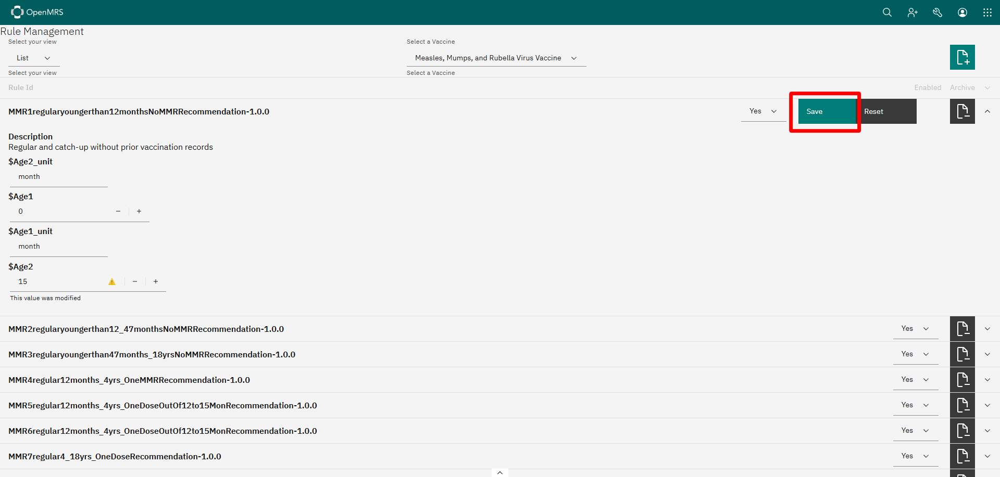

4. This will send the request to modify the rule to the `cdss` backend module, and it will in turn, send the request to the configure `rule-modification-service`. If the modification is successful, then a new rule will be created (typically in the bottom of the list/table) with the new value and an increment version number. See the following screenshot.
   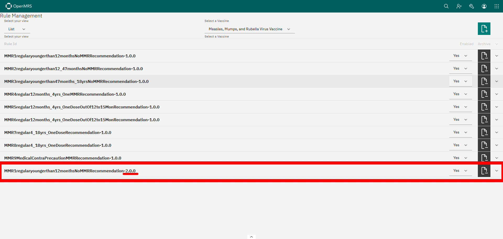

> 💡 **Tip:** To troubleshoot upload or modification failures, open your browser’s Developer Tools (typically F12 or right-click → Inspect), navigate to the **Network** tab, and inspect the failed request for more detailed error messages.
> 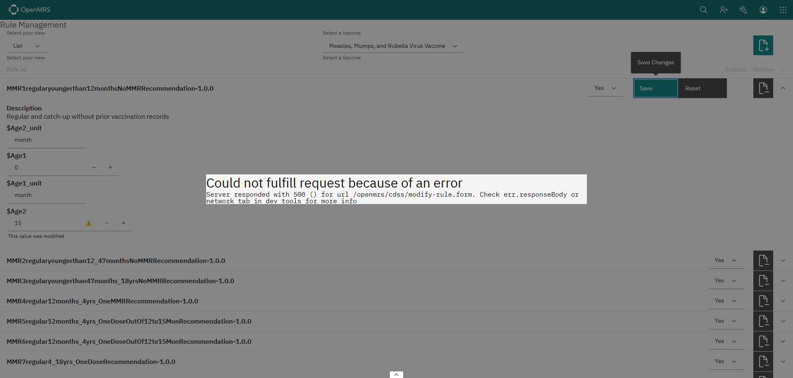

## Upload a Rule

To add a rule, the CQL rule MUST be compliant with the [CDSS4PCP Rule Standards (Comping Soon)](#)

1. Click *Upload a new Rule* button
   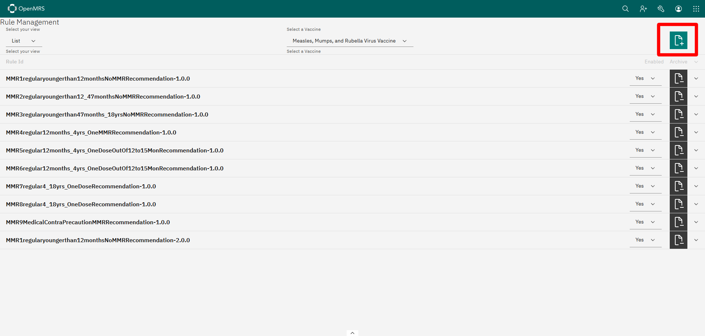

2. This will open a dialog to upload a `.cql` rule file and fields to enter:
   
   - *Library Name*: The name that the rule has. It must match the name in the `.cql` file. This is **REQUIRED**.
   
   - *Library Version*: The version of the rule. It must match the version in the `.cql` file and be compliant with [SemVer](https://semver.org/) version string format. This is **REQUIRED**.
   
   - *Description*: A brief summary of the rule and what it is for. This is mostly for the users purposes. This is optional.
   
   - *Vaccine*: Typically, every rule is a rule about a certain vaccine. You can enter your own vaccine in this field or select one from the list. This is optional.
   
   - *Enabled*: Check this if the rule should be enabled by default. This is optional.
   
   - *Add file*: Select a `.cql` file to upload.
     
     > **TIP:** If you select a `.cql` without entering any information in the above fields, the system will attempt to parse the `cql` file and extract it's *Library Name*, *Library Version*, *Vaccine* and parameters.
     
     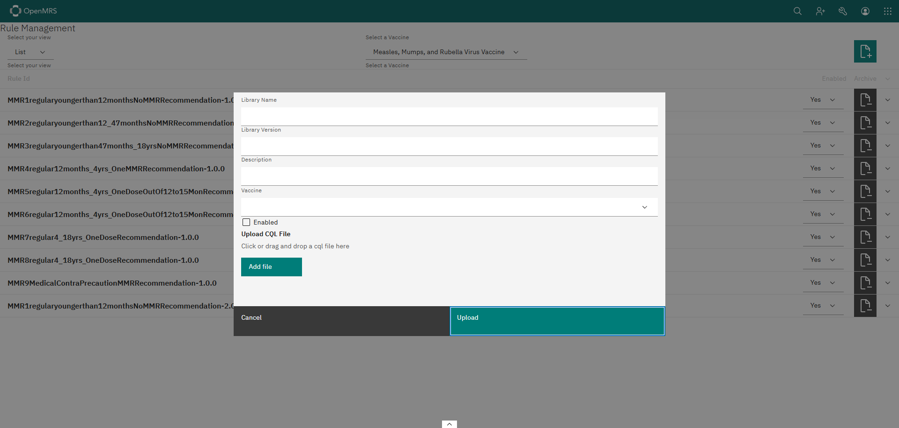

3. Let us upload an example rule. Create a new file called `CdssExample-1.0.0.cql` and paste in the following contents.
   
   ```cql
   library "CdssExample" version '1.0.0'
   
   using FHIR version '4.0.1'
   
   context Patient
   
   define "$IntegerParameter": 0
   
   define "$StringParameter": 'month'
   
   define "$BooleanParameter": true
   
   define "VaccineName": 
      'Example Vaccine'
   
   define "Recommendation1":
     'This is just example. Please disregard'
   ```

4. Click on *Add file* and select `CdssExample-1.0.0.cql`. 
   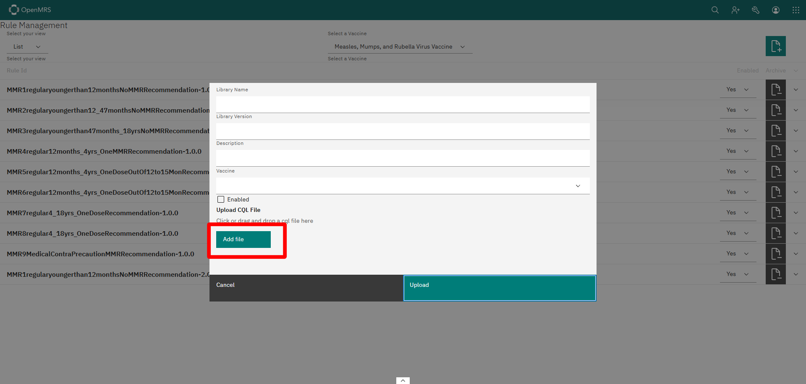

5. Notice how the blank fields get filled in with the information in the `CdssExample-1.0.0.cql`. Now, click on *Upload*.
      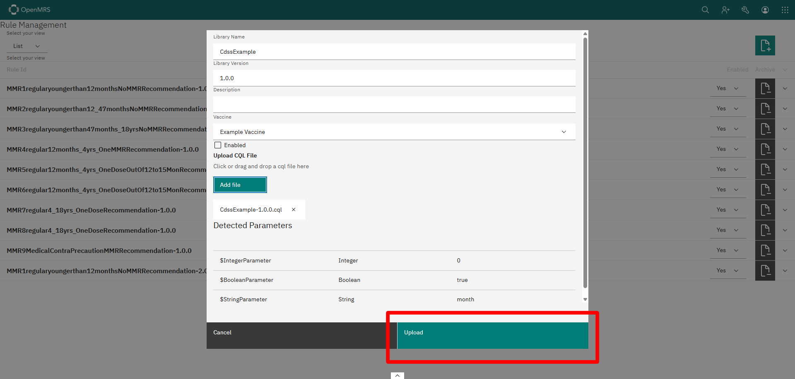

6. Now, that the rule is uploaded, select*Example Vaccine* from the vaccine selection. (You might need to refresh the page)
   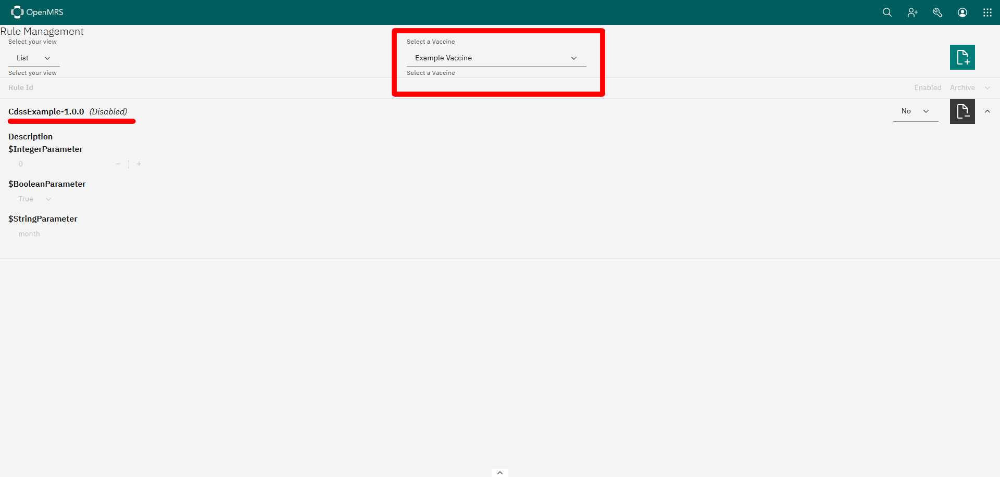

7. Now, `CdssExample-1.0.0` will be in the list of rules. It will not be enabled because the *Enabled* checkbox was not checked when uploading the rule.

## Archiving Rules

There is no functionality to delete rules from the GUI, but an option to "archive" is available. Archiving means that the rule will no longer be able to be enabled, modified or used in any other way. To use an archived rule, it is necessary to restore the rule.

### Archive a rule

1. Find the rule that you wish to be archived. Click on the gray *Archive Rule* button to the right of the rule. We will archive the uploaded `CdssExample-1.0.0`
   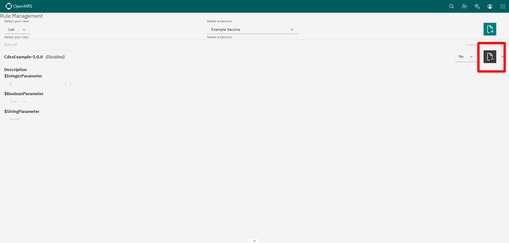
2. A dialog will open asking you to confirm the archive action. Click *Yes* to archive.
   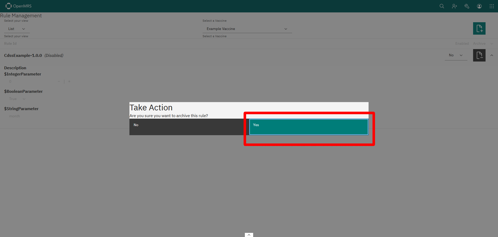
3. Now, `CdssExample-1.0.0` is archived and no longer in the list of rules.
   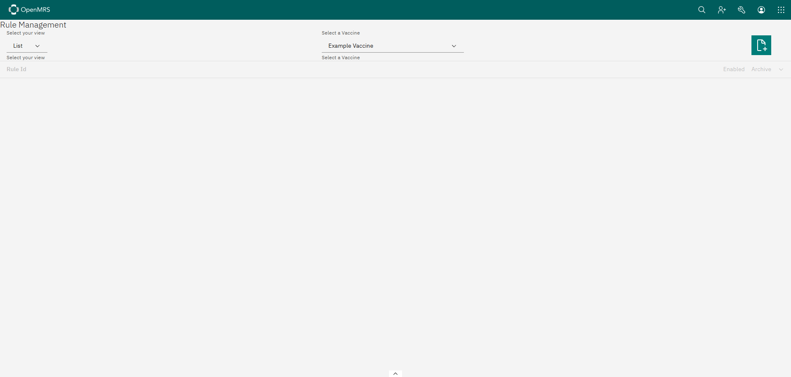

### View archived rules

1. Click on *App Menu* in the top right.
   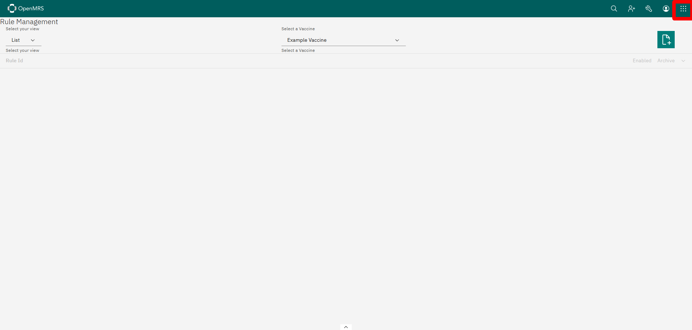

2. Click on *CDSS Rule Archive* 
    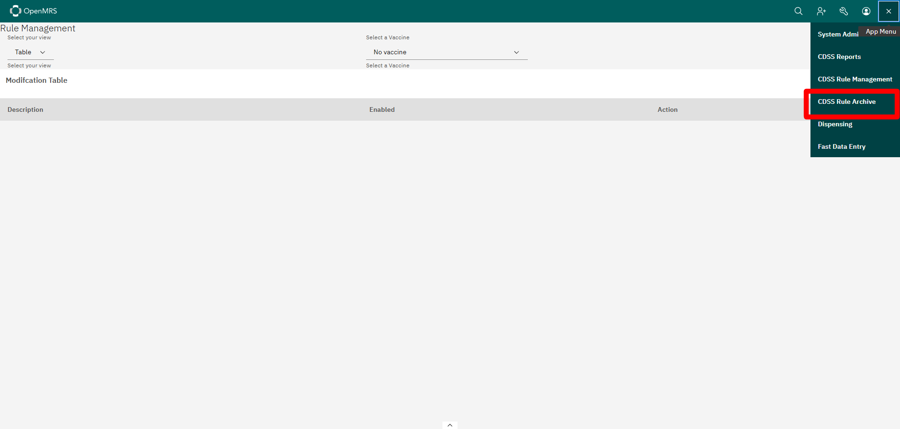

3. This is the *CDSS Rule Archive* page. You can see `CdssExample-1.0.0` is listed here.
    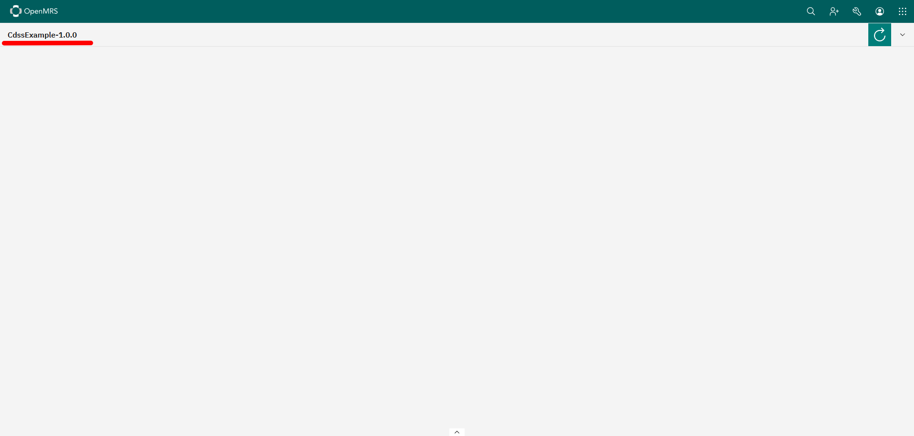

### Restore an archive rule

1. In the *CDSS Rule Archive* page, find the rule that you want to restore.

2. Click on *Restore Rule* to the right of the rule 
    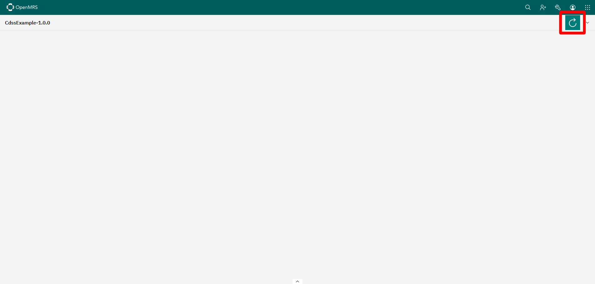

3. A dialog will open asking you to confirm the restore action. Click *Yes* to restore.
   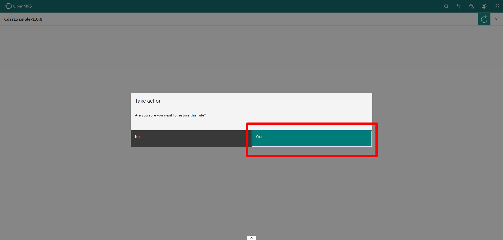

4. Now the rule is restored and can be seen, enabled, disabled, used in the *CDSS Rule Management* page.
