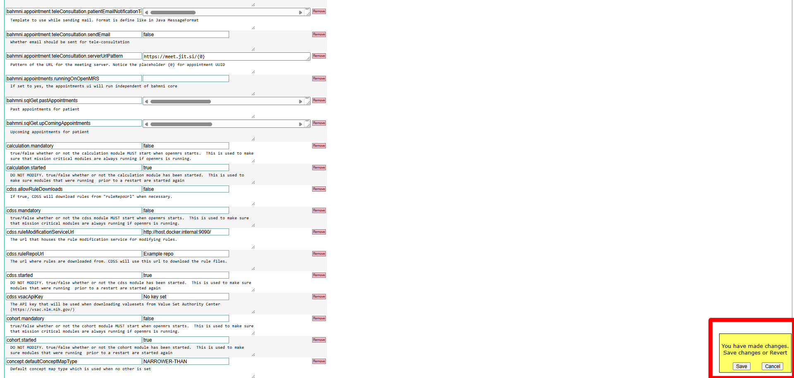

# Rule Modification Service Setup

###### Rev 06/24/2024

## Requirements

- OpenMRS with the `cdss` module and `cdss-esm-app` module. Follow [Technical INSTALLATION.md](https://github.com/xjing16/EMR_EHR4CDSSPCP/blob/main/OpenMRS/docs/Installation-Technical/INSTALLATION.md) or [User friendly INSTALLATION.md](https://github.com/xjing16/EMR_EHR4CDSSPCP/blob/main/OpenMRS/docs/Installation-User-Friendly/INSTALLATION.md).

### Setup the rule-modification-service

1. Clone the [rule-modification-service](https://github.com/DrSmCraft/rule-modification-service) repository.

2. `cd` into the `rule-modification-service` directory

3. Run 
   
   ```bash
   docker compose up -d
   ```
   
   to create and start the rule modification service. By default it will run on port 9090. (You can change this in the [`docker-compose.yml`](https://github.com/DrSmCraft/rule-modification-service/blob/master/docker-compose.yml) file.

### Configure OpenMRS to use the rule-modification-service

Configure the URL where OpenMRS will use the `rule-modification-service`

1. Open The OpenMRS home page and login [http://localhost/openmrs](http://localhost/openmrs)

2. Go to the Administration page
   

3. Click on *Advanced Settings*)
   

4. Search for *cdss.ruleModificationServiceUrl*
   

5. Enter the URL for the rule modification service in the box that says *No key set*
    NOTE: If the rule modification service is running on Docker on the same machine on port 9090, use `http://host.docker.internal:9090/`
    

6. Click *Save* in the Yellow box at the bottom right.
    