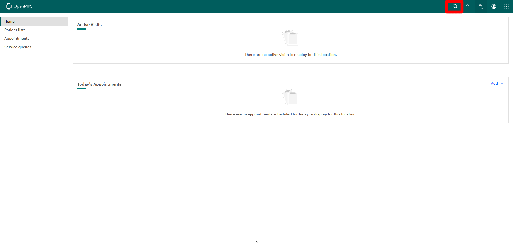
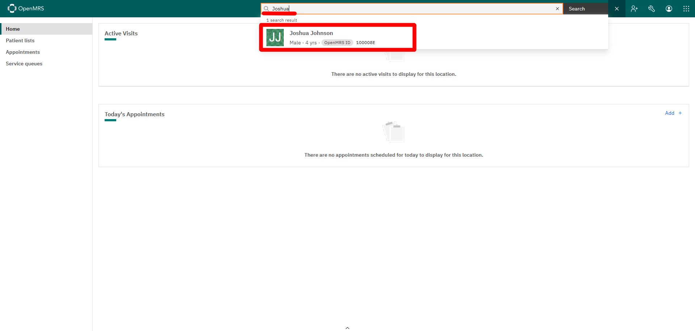
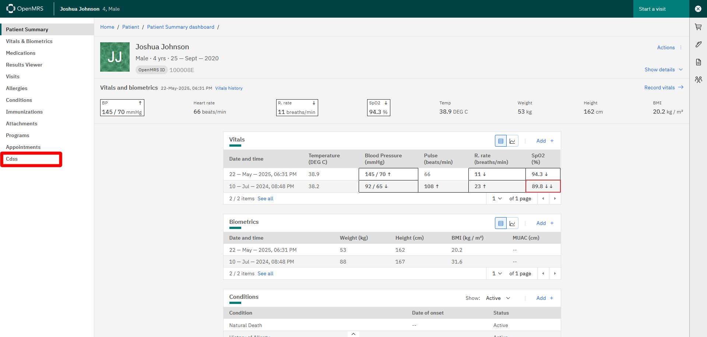
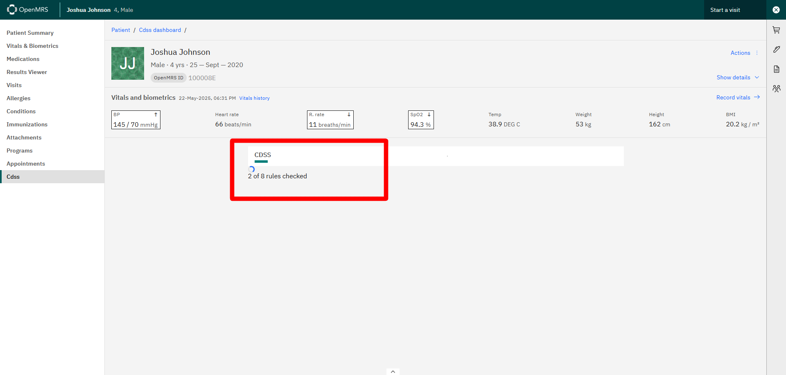
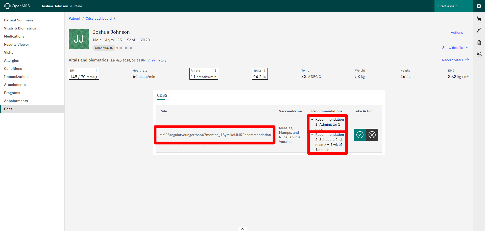
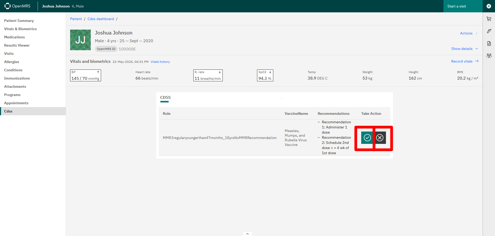

# Using CDSS

###### Rev 06/24/2024

## Prerequisites

Ensure the following are installed and running:

- **OpenMRS** with the following modules:
  - `cdss` module
  - `cdss-esm-app` module

Refer to the following installation guides:

- [Technical Installation Guide](https://github.com/xjing16/EMR_EHR4CDSSPCP/blob/main/OpenMRS/docs/Installation-Technical/INSTALLATION.md)
- [User-Friendly Installation Guide](https://github.com/xjing16/EMR_EHR4CDSSPCP/blob/main/OpenMRS/docs/Installation-User-Friendly/INSTALLATION.md)
- CSRF disabled

## Steps

1. Go to the [OpenMRS homepage](http://localhost/openmrs/spa/home) and click on *Search*
    

2. Type in a name for a patient. For example, `Joshua Johnson`. Select the patient
    

3. This is the patient dashboard for `Joshua Johnson`. To use CDSS, click on *CDSS* on the left menu.
    

4. You will see a progress message explaining that the rules are being checked.

> **Note:** Only enabled and non-archived rules are used.

5. Once all the rules are consulted, only rules that generated reccomendations will be displayed. Here we see that rule `MMR3regularyoungerthan47months_18yrsNoMMRRecommendation` generated two recommendations: 
- Recommendation 1: Administer 1 dose

- Recommendation 2: Schedule 2nd dose > = 4 wk of 1st dose
  
  
  
  5.You can accept the recommendations by clicking the green `Checkmark` button or decline the recommendations by clicking the grey `X` button
  
